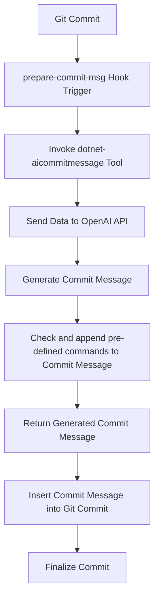

# 

🧠 🤖 This tool generates AI-powered commit messages via Git hooks, automating meaningful message suggestions from OpenAI and others to improve commit quality and efficiency.

[](https://wakatime.com/badge/github/guibranco/dotnet-aicommitmessage)
[](https://wakatime.com/badge/github/guibranco/dotnet-aicommitmessage)
[](https://wakatime.com/badge/github/guibranco/dotnet-aicommitmessage)

[](https://github.com/guibranco/dotnet-aicommitmessage/actions/workflows/build.yml)
[](https://github.com/guibranco/dotnet-aicommitmessage/actions/workflows/ci.yml)
[](https://github.com/guibranco/dotnet-aicommitmessage/actions/workflows/infisical-secrets-check.yml)
[](https://github.com/guibranco/dotnet-aicommitmessage/actions/workflows/linter.yml)

---

## What this tool does

Generates a commit message based on the `git diff` result using the [OpenAI API](https://platform.openai.com/docs/overview).

---

## Requirements

- [OpenAI API key](https://platform.openai.com/api-keys).
- [.NET 8.0 (or higher) runtime](https://dotnet.microsoft.com/en-us/download/dotnet/8.0).
- [GIT client](https://git-scm.com/downloads).

---

## Getting started

[](https://www.nuget.org/packages/AICommitMessage/)
[](https://www.nuget.org/packages/AICommitMessage/)

This repository is available at [NuGet](https://www.nuget.org) under the name [AICommitMessage](https://www.nuget.org/packages/AICommitMessage/).

### Installation

1. Install the tool globally (or per project/repository).
2. Move to the project folder.
3. Install the Git hook on the default `hooks` directory.

```ps
dotnet tool install -g AiCommitMessage
cd my-project/
dotnet-aicommitmessage install-hook
git add .
git commit -m ""
```

Use `git log -1` to review the last commit details and find the automatically generated commit message.

---

### Model Configuration and Settings

To configure and use models with `dotnet-aicommitmessage`, users need to set their settings once. This setup involves specifying the model, API key, and API URL. These settings will be stored as environment variables for future use.

#### Initial Setup

Run the following commands to configure the model and related settings:

```
dotnet-aicommitmessage set-settings -m gpt-4o-mini -k {api-key} -u {api-url}
dotnet-aicommitmessage set-settings -m llama-3-1-405b-instruct -k {api-key} -u {api-url}
```

Replace `{api-key}` with your API key and `{api-url}` with the URL of your API provider.

#### Switching Models

After the initial setup, you can easily switch between models without needing to provide the API key or URL again:

```
dotnet-aicommitmessage set-settings -m gpt-4o-mini
dotnet-aicommitmessage set-settings -m llama-3-1-405b-instruct
```

This allows for quick model changes while retaining your previously configured API details.

---

#### Supported Models

Currently supported models are `gpt-4o-mini` and `llama-3-1-405b-instruct`.

---

## Commit message pattern

The training model for the AI used is designed using as reference these guidelines:

- [Conventional Commits v1.0.0](https://www.conventionalcommits.org/en/v1.0.0/).
- [Padrões de Commits](https://github.com/tiagolofi/padroes-de-commits) (in Portuguese).
- [Conventional Commit Messages](https://gist.github.com/qoomon/5dfcdf8eec66a051ecd85625518cfd13).
- [Emoji for Conventional Commits](https://gist.github.com/parmentf/359667bf23e08a1bd8241fbf47ecdef0).
- [conventional-commit-types](https://github.com/pvdlg/conventional-commit-types).

---

## Sequence of Execution

Here’s a flow diagram showing the sequence of execution of the `prepare-commit-msg` hook and its integration with `dotnet-aicommitmessage` to generate commit messages using the OpenAI API:



---

## Commands

This tool accepts an argument as the command to execute. Here is a list of available commands:

| Command                    | Description                                                                                                     |
| -------------------------- | --------------------------------------------------------------------------------------------------------------- |
| `install-hook`             | Installs GIT hooks in the default `.git/hooks` directory or in the custom directory configured in GIT settings. |
| `generate-message`         | Generates a commit message based on the current changes (`git diff` context).                                   |
| `set-settings`             | Set the OpenAI settings.                                                                                        |
| `help`                     | Display information about this program.                                                                         |
| `version`                  | Display version information.                                                                                    |

---

## Example output

Here is an example of the commit messages generated in a real-world project:


## Debug

You can run the message generation manually to debug it, but it will not commit the content to your GIT repository. 
If you also want to check the OpenAI JSON response, append the `-D` parameter.

### Manually generating the commit message

To manually generate a commit message without committing the staged changes, run the following command:

```ps
dotnet-aicommitmessage generate-message -m "."
```

### Saving the OpenAI JSON response

If you want to persist the OpenAI JSON response, add the `-D` parameter, and a `debug.json` file will be created with the response JSON.

```ps
dotnet-aicommitmessage generate-message -Dm "."
```

Here is a sample `debug.json` content:

```json
{
  "Value": {
    "CreatedAt": "2024-11-20T12:54:03+00:00",
    "FinishReason": 0,
    "ContentTokenLogProbabilities": [],
    "RefusalTokenLogProbabilities": [],
    "Role": 2,
    "Content": [
      {
        "Kind": 0,
        "Text": "feat - add reactivation handling for refunds due today",
        "ImageUri": null,
        "ImageBytes": null,
        "ImageBytesMediaType": null,
        "ImageDetailLevel": null,
        "Refusal": null
      }
    ],
    "ToolCalls": [],
    "Refusal": null,
    "FunctionCall": null,
    "Id": "chatcmpl-[[REDACTED]]",
    "Model": "gpt-4o-mini-2024-07-18",
    "SystemFingerprint": "fp-[[REDACTED]]",
    "Usage": {
      "OutputTokenCount": 10,
      "InputTokenCount": 6229,
      "TotalTokenCount": 6239,
      "OutputTokenDetails": {
        "ReasoningTokenCount": 0
      }
    }
  }
}
```

---

### Contributors

<!-- readme: collaborators,contributors,snyk-bot/-,guistracini-outsurance-ie/-,codefactor-io/- -start -->
<table>
	<tbody>
		<tr>
            <td align="center">
                <a href="https://github.com/guibranco">
                    
                    <br />
                    <sub><b>Guilherme Branco Stracini</b></sub>
                </a>
            </td>
            <td align="center">
                <a href="https://github.com/Malay-dev">
                    
                    <br />
                    <sub><b>Malay Kumar</b></sub>
                </a>
            </td>
            <td align="center">
                <a href="https://github.com/RyanFloresTT">
                    
                    <br />
                    <sub><b>Ryan Flores</b></sub>
                </a>
            </td>
		</tr>
	<tbody>
</table>
<!-- readme: collaborators,contributors,snyk-bot/-,guistracini-outsurance-ie/-,codefactor-io/- -end -->

### Bots

<!-- readme: bots,snyk-bot,codefactor-io -start -->
<table>
	<tbody>
		<tr>
            <td align="center">
                <a href="https://github.com/dependabot[bot]">
                    
                    <br />
                    <sub><b>dependabot[bot]</b></sub>
                </a>
            </td>
            <td align="center">
                <a href="https://github.com/penify-dev[bot]">
                    
                    <br />
                    <sub><b>penify-dev[bot]</b></sub>
                </a>
            </td>
            <td align="center">
                <a href="https://github.com/gitauto-ai[bot]">
                    
                    <br />
                    <sub><b>gitauto-ai[bot]</b></sub>
                </a>
            </td>
            <td align="center">
                <a href="https://github.com/github-actions[bot]">
                    
                    <br />
                    <sub><b>github-actions[bot]</b></sub>
                </a>
            </td>
            <td align="center">
                <a href="https://github.com/pixeebot[bot]">
                    
                    <br />
                    <sub><b>pixeebot[bot]</b></sub>
                </a>
            </td>
            <td align="center">
                <a href="https://github.com/snyk-bot">
                    
                    <br />
                    <sub><b>Snyk bot</b></sub>
                </a>
            </td>
		</tr>
		<tr>
            <td align="center">
                <a href="https://github.com/codefactor-io">
                    
                    <br />
                    <sub><b>CodeFactor</b></sub>
                </a>
            </td>
		</tr>
	<tbody>
</table>
<!-- readme: bots,snyk-bot,codefactor-io -end -->
