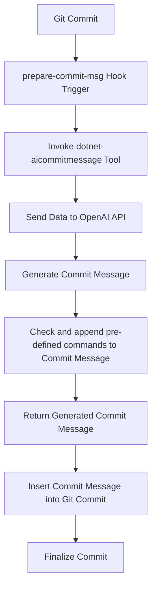

# 

🧠 🧰 This tool generates AI-powered commit messages via Git hooks, automating meaningful message suggestions from OpenAI and others to improve commit quality and efficiency.

[](https://wakatime.com/badge/github/guibranco/dotnet-aicommitmessage)
[](https://wakatime.com/badge/github/guibranco/dotnet-aicommitmessage)
[](https://wakatime.com/badge/github/guibranco/dotnet-aicommitmessage)

[](https://github.com/guibranco/dotnet-aicommitmessage/actions/workflows/build.yml)
[](https://github.com/guibranco/dotnet-aicommitmessage/actions/workflows/ci.yml)
[](https://github.com/guibranco/dotnet-aicommitmessage/actions/workflows/infisical-secrets-check.yml)
[](https://github.com/guibranco/dotnet-aicommitmessage/actions/workflows/linter.yml)

---

> [!CAUTION]
> This is still in development/beta. It will be **GA** when a major release 1 becomes available.

## What this tool does

Generates a commit message based on the `git diff` result using the [OpenAI API](https://platform.openai.com/docs/overview).

---

## Requirements

- [OpenAI API key](https://platform.openai.com/api-keys).
- [.NET 8.0 (or higher) runtime](https://dotnet.microsoft.com/en-us/download/dotnet/8.0).
- [GIT client](https://git-scm.com/downloads).

---

## Getting started

[](https://www.nuget.org/packages/AICommitMessage/)
[](https://www.nuget.org/packages/AICommitMessage/)

This repository is available at [NuGet](https://www.nuget.org) under the name [AICommitMessage](https://www.nuget.org/packages/AICommitMessage/).

### Installation

1. Install the tool globally (or per project/repository).
2. Move to the project folder.
3. Install the Git hook on the default `hooks` directory.

```ps
dotnet tool install -g AiCommitMessage
cd my-project/
dotnet-aicommitmessage install-hook
git add .
git commit -m ""
```

Use `git log -1` to review the last commit details and find the automatically generated commit message.

---

## Commit message pattern

The training model for the AI used is designed using as reference these guidelines:

- [Conventional Commits v1.0.0](https://www.conventionalcommits.org/en/v1.0.0/).
- [Padrões de Commits](https://github.com/tiagolofi/padroes-de-commits) (in Portuguese).
- [Conventional Commit Messages](https://gist.github.com/qoomon/5dfcdf8eec66a051ecd85625518cfd13).
- [Emoji for Conventional Commits](https://gist.github.com/parmentf/359667bf23e08a1bd8241fbf47ecdef0).
- [conventional-commit-types](https://github.com/pvdlg/conventional-commit-types).

---

## Sequence of Execution

Here’s a flow diagram showing the sequence of execution of the `prepare-commit-msg` hook and its integration with `dotnet-aicommitmessage` to generate commit messages using the OpenAI API:



---

## Commands

This tool accepts an argument as the command to execute. Here is a list of available commands:

| Command                    | Description                                                                                                     |
| -------------------------- | --------------------------------------------------------------------------------------------------------------- |
| `install-hook`             | Installs GIT hooks in the default `.git/hooks` directory or in the custom directory configured in GIT settings. |
| `generate-message`         | Generates a commit message based on the current changes (`git diff` context).                                   |
| `set-settings`             | Set the OpenAI settings.                                                                                        |
| `help`                     | Display information about this program.                                                                         |
| `version`                  | Display version information.                                                                                    |

---

## Example output

Here is an example of the commit messages generated in a real-world project:


## Code Scanning with CodeQL

This repository uses GitHub's CodeQL for automated code scanning to enhance code quality and security.

### Setup

The CodeQL analysis is configured to run on every push and pull request to the `main` branch, as well as on a weekly schedule.

### Addressing Issues
