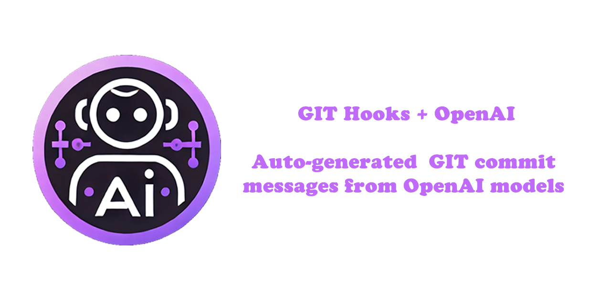

# 

🧠 🧰 This tool generates AI-powered commit messages via Git hooks, automating meaningful message suggestions from OpenAI and others to improve commit quality and efficiency.

---

## What does I do

Generates a commit message based on `git diff` result using the [OpenAI](https://platform.openai.com/docs/overview) API.

---

## Getting started

```ps
dotnet tool install -g AiCommitMessage
cd my-project/
dotnet-aicommitmessage install-hook
```

1. Install the tool globally.
2. Move to the project folder.
3. Install the Git hook on the default `hooks` directory.

---
